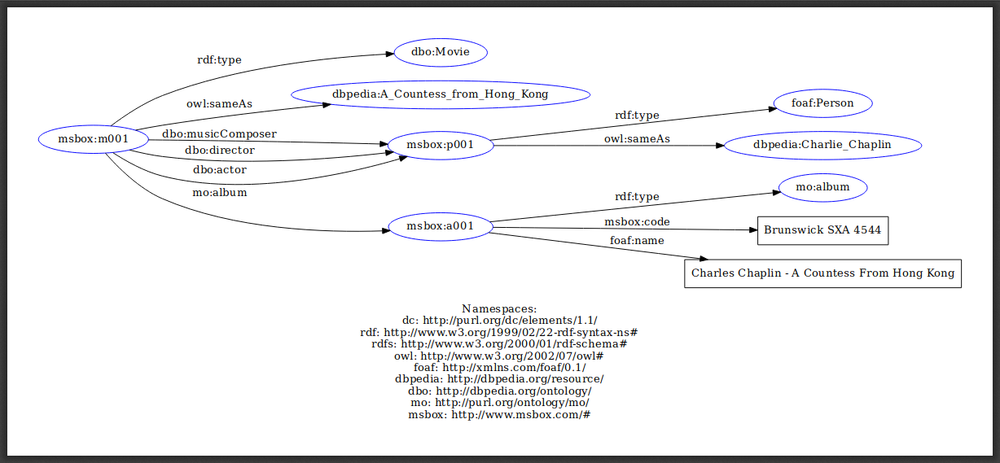

# MSBox (Movie & Soundtrack Box)
ST001 project that is taught at the Unicamp School of Technology (FT). The project consists of queries to databases that are on the Internet - primarily in HTML format - and database queries that are in Resource Description Framework (RDF) format. First, an RDF Turtle file is generated containing the crawled web data, and then the existing ontologies and features are added to this file.

## Overview
Getting data from HTML sources is often a laborious task that requires a lot of effort from programmers. Lack of pattern on pages and data are some of the biggest annoyances to us.
While obtaining data for the design of this project, I came across exactly these problems. The solution was to get them manually (we often call this “fingernailing”) one by one in small numbers rather than scraping or crawling through code.

## Goals
- Track Search: The main, and most important, objective of this project is to search tracks from movie data.
- Album Search: Obtaining album names is a direct - not least - consequence of searching for tracks from movie data.
- Other possible researches: composer research from movie data, movie research, actor research and director research.

## Specifications
For the RDF Turtle document, the following RDF dictionaries were used:
- Dublin Core (dc): vocabulary that allows the description of metadata (data on data).
- RDF Syntax (rdf): Vocabulary that defines the terms required to create RDF vocabularies.
- RDF Schema (rdfs): vocabulary that describes classes and relationships between them.
- Web Ontology Language (owl): A vocabulary that allows the description of ontologies (representations of facts and rules about a domain of knowledge).
- Friend of a Friend (foaf): Vocabulary that defines terms to describe people, their activities, and their relationships with other people and objects.
- DBpedia Resource (dbpedia): Vocabulary that represents the data contained in Wikipedia in RDF format.
- DBpedia Ontology (dbo): vocabulary that defines the ontologies used in DBpedia.
- Music Ontology (mo): Ontology vocabulary for creating music-related data.
- MSBox (msbox): Vocabulary created for this project. Its purpose is to allow the manipulation of data about movies, soundtracks, tracks, etc.

## Terms created
Note: “---” is an index starting at 001 and incrementing with each new data obtained.
- msbox:m---: ontology designed to describe data about movies.
- msbox:p---: an ontology designed to describe data about people, whether related to movies or soundtracks.
- msbox:a---: ontology designed to describe album data.
- msbox:code: Literal data used to describe the album code.

## Data Model

The final RDF has 368 triples.

## SPARQL Query Examples
- soundtrackQuery.py: Search for all movie related tracks.

## Dependencies
- rdflib: library that allows working with RDF.

## Data Sources
- Charlie Chaplin Filmography - http://www.adorocinema.com
- Soundtracks data - http://www.soundtrackcollector.com
- Open data connected - http://dbpedia.org (DBPedia)
